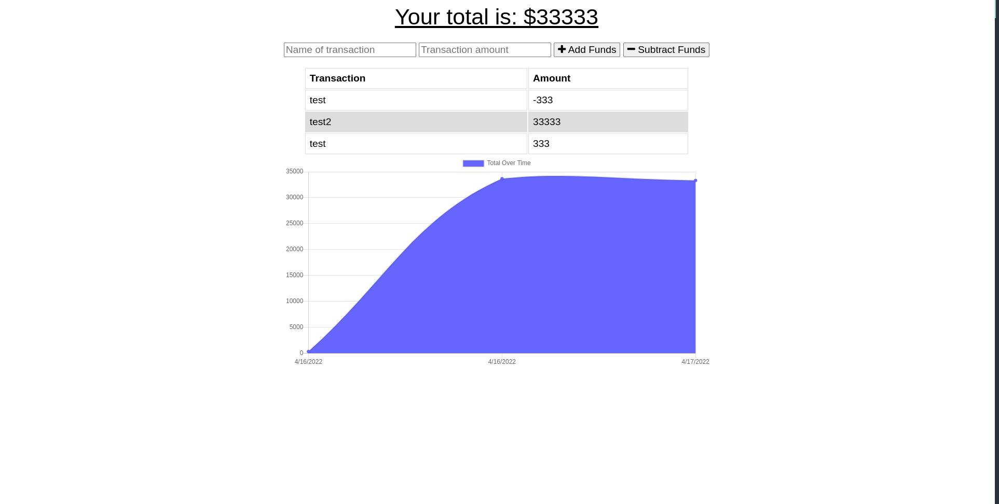

# Title: Budget Tracker PWA

## Table of contents:

- [ Description ](#about)
- [ Installation ](#installation)
- [ Usage ](#usage)
- [ Languages ](#languages)

- [ Questions ](#questions)

## Description:

This is a simple expense manager with offline capabilitie

## Installation:

    npm install

## Usage:

Run `npm start` to initialize the server

## Languages:

    JavaScript, ES6, Node

## Questions:

Username: <a href=https://github.com/benjamind10>benjamind10</a>

E-Mail: ben@bytebug.io
